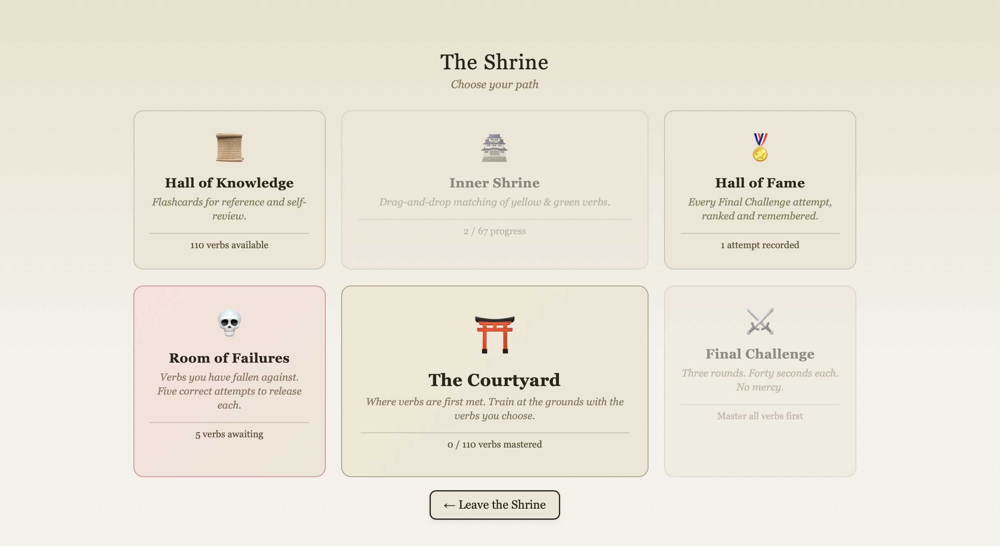

# The Shrine of Verbs

A browser game for mastering the 110 most common English irregular verbs — the ones that refuse to follow rules and bend only to memory. Built for English learners (with Russian translations) who need to drill the three forms — infinitive, past simple, past participle — until they stick.

**▶️ [Play it here](https://ahrilover67.github.io/shrine-of-verbs/)**

> *"The verbs you seek do not bend to rules — they bend only to memory. Walk the courtyard. Train. Return when you are ready."*

---

## What it is

The Shrine of Verbs is a single, self-contained web app styled as a quiet monastery. A monk guides you through it. There are no accounts, no installs, and no servers — you open the link and play. Your progress is remembered in your own browser between visits.

It's designed as a study tool: pick the verbs you want to work on, train them under pressure, and track which ones you've actually conquered.

## How it works

The shrine is built around several rooms, each a different way to learn:

- **The Courtyard** — where verbs are first met. Choose from the 110 irregular verbs and train at your own pace, with Russian translations alongside each.
- **The Inner Shrine** — a drag-and-drop matching exercise for verbs you've started to learn.
- **The Hall of Knowledge** — flashcards for reference and quiet self-review.
- **The Final Challenge** — a timed trial with no mercy: three rounds, ten verbs each, forty seconds per verb. You're shown the Russian and must write all three English forms from memory.
- **The Room of Failures** — the verbs you've fallen against. Each needs five correct attempts to release.
- **The Hall of Fame** — every Final Challenge attempt, ranked and remembered.

## For teachers

There's a built-in **Teacher Mode** for classroom use, accessible from the panel in the corner.

## Tech

A single `index.html` file — plain HTML, CSS, and JavaScript with no frameworks and no dependencies. Progress is stored locally in the browser via `localStorage`, which means it's per-device: progress made on a phone won't carry over to a laptop. The whole thing is hosted free on GitHub Pages.

## Running it locally

Download `index.html` and double-click it. That's the entire setup — it runs in any modern browser, offline.
